## Introduction

image from istock.com

The Employees Data Analysis Report provides a comprehensive overview of key insights gathered from the analysis of employee data within the Company. The analysis encompasses various aspects of employee information, aiming to uncover trends, patterns, and actionable insights that can contribute to informed decision-making and improved organizational performance.

## Dataset Overview
The dataset consisted of several vital columns including,
- Employee ID
- Full Name
- Job Title
- Department
- Business Unit
- Gender
- Ethnicity
- Age
- Hire Date
- Annual Salary
- Bonus Percentage
- Country
- City
- Exit Date

## Project Objectives:

•	Analyze employee data using SQL to uncover insights.
•	Transform the insights into meaningful KPIs.
•	Create an interactive Power BI dashboard to visualize the KPIs.

## Methodology

I opened the CSV dataset and renamed some columns; employee ID to employee_ID, Full name to Full_name, Job title to Job_title, Business unit to Business_unit, Hire Date to Hire_date, Annual salary to Annual_salary, Bonus % to Bonus_percentage and Exit date to Exit_date. Then I saved the file as Excel 97 - 2003 template. 

Afterward, I imported the employee sample data into the Project database using Microsoft SQL Server Management Studio. By crafting a set of thoughtfully designed SQL queries, I accomplished the project objectives. These queries were strategically formulated to address various aspects of the dataset, enabling the extraction of specific insights. Each query was accompanied by detailed comments explaining the rationale behind its construction. Through the skillful application of appropriate aggregate functions, precise grouping techniques, and systematic data ordering, I effectively aggregated and summarized the dataset. This process yielded meaningful and actionable results, contributing to the overall project's success.

## SQL Queries and Analysis

### Sample Analysis Questions:

--1. How many employees are there in each department?

`SELECT department, COUNT(DISTINCT employee_id) AS num_of_employees
FROM employees
GROUP BY department
ORDER BY num_of_employees;`

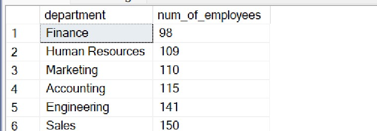

_This query groups the employees by their department and calculates the count of employees in each department using the
 COUNT aggregate function. The result shows the department and the corresponding number of employees in that department._

--2. What is the average age of employees in the Sales department?

`SELECT department, ROUND(AVG(age), 2) AS avg_age
FROM employees
WHERE department = 'Sales'
GROUP BY department;`

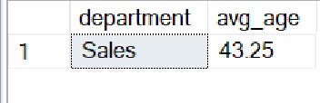

_This query calculates the average age of employees in the Sales department directly from the "age" column._

--3. Who are the top 5 highest-paid employees in the company?

`SELECT TOP 5 full_name, annual_salary
FROM employees
ORDER BY annual_salary DESC;`

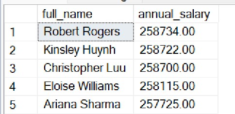

_This query retrieves the full name, and salary from the employees table, orders the results in descending order based on the salary, and then limits the output to the top 5 rows._

--4. What is the distribution of employees across different genders and ethnicities?

`SELECT gender, ethnicity, COUNT(*) AS employeees_count
FROM employees
GROUP BY gender, ethnicity
ORDER  BY employeees_count;`

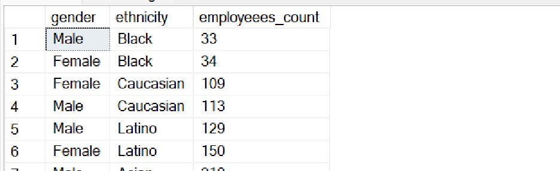

_This query groups the data by the gender and ethnicity columns and calculates the count of employees for each combination of gender and ethnicity._

--5. How has the average salary changed over the years?

`SELECT YEAR(hire_date) AS Year, AVG(annual_salary) AS avg_salary
FROM employees
GROUP BY YEAR(hire_date)
ORDER BY YEAR(hire_date) DESC;`

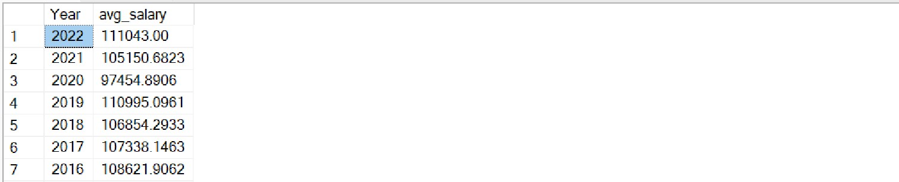

This query uses the AVG aggregate function to calculate the average salary for each year. The GROUP BY clause groups the data by year, and the ORDER BY clause ensures that the results are sorted in ascending order of year.

--6. Which department has the highest average bonus percentage?

`SELECT TOP 1 department, ROUND(AVG(bonus_percentage), 2) AS bonus_percentage
FROM employees
GROUP BY department
ORDER BY bonus_percentage DESC;`

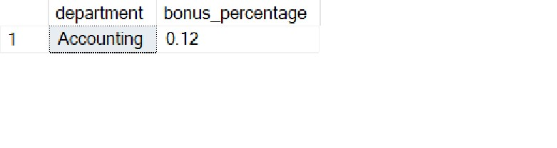

_This query calculates the average bonus percentage for each department, orders the results in descending order of average bonus percentage, and then limits the result to just the top row, which will be the department with the highest average bonus percentage._

--7. Identify employees who exited the company within their first year.

`SELECT employee_id, full_name, hire_date, exit_date
FROM employees
WHERE exit_date IS NOT NULL AND exit_date <= DATEADD(YEAR, 1, hire_date);`

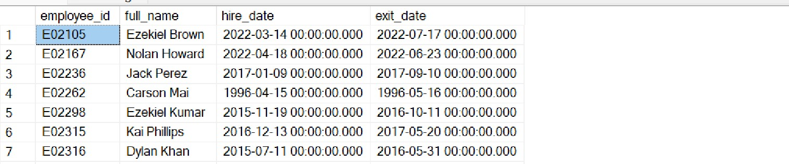

_This query selects the employee_id, full_name, hire_date, and exit_date columns from the employees' table and filters the results to include only rows where the exit_date is not null (indicating that the employee has exited) and the exit_date is within one year from the hire_date._

--8. Calculate the total annual salary expenditure for each business unit.

`SELECT business_unit, ROUND(SUM(annual_salary), 2) AS total_salary
FROM employees
GROUP BY business_unit
ORDER BY total_salary;`

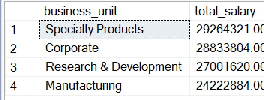

_This query uses the SUM() function to calculate the total salary for each business unit and uses the GROUP BY clause to group the results by the business_unit column so that we get the total salary expenditure for each unique business unit._

--9. What is the average age of employees in each city?

`SELECT city, ROUND(AVG(age), 2) AS avg_age
FROM employees
GROUP BY city
ORDER BY avg_age DESC;`

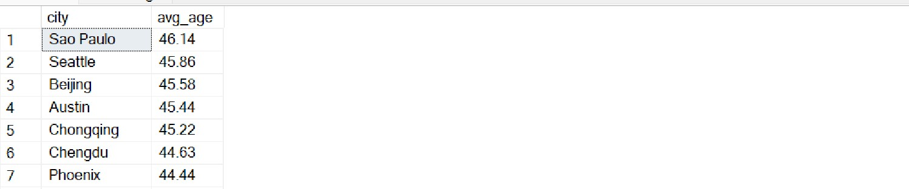

_This query groups the employees by city and calculates the average age for each city using the AVG aggregate function._

--10. Determine the average salary for each job title.

`SELECT job_title, ROUND(AVG(annual_salary), 2) AS avg_salary
FROM employees
GROUP BY job_title
ORDER BY avg_salary DESC;`

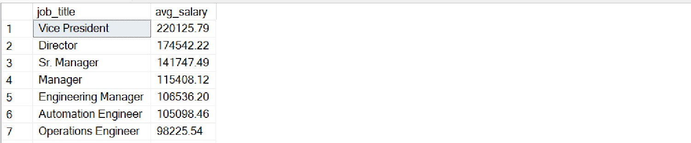

_The query calculates the average salary for each unique job title present in the table using the AVG aggregate function and groups the results by the job title using the GROUP BY clause._

--11. Compare the average bonus percentage between different departments.

`SELECT department, ROUND(AVG(bonus_percentage), 2) AS avg_bonus
FROM employees
GROUP BY department
ORDER BY avg_salary DESC;`

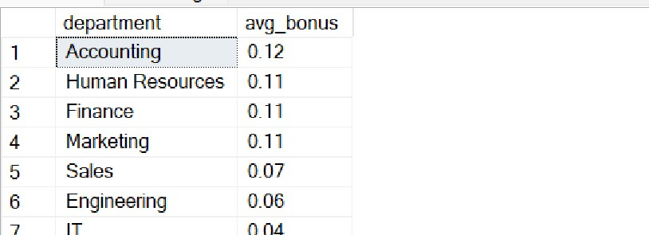

_The query calculates the average salary for each department using the AVG aggregate function and groups the results by the department using the GROUP BY clause._

--12. How many employees have left the company, and what is their average tenure?

`SELECT COUNT(*) AS count_of_employees, AVG(DATEDIFF(DAY, hire_date, exit_date)) AS average_tenure
FROM employees
WHERE exit_date IS NOT NULL;`

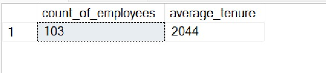

_The query calculates the count of employees who have a non-null "exit_date" (indicating they have left the company) and calculates the average tenure by using the DATEDIFF function to calculate the difference in days between the "exit_date" and "hire_date"._

--13. Identify employees who have been with the company for more than 10 years.

`SELECT employee_id, full_name, hire_date
FROM employees
WHERE DATEDIFF(DAY, hire_date, GETDATE()) > 3650;`

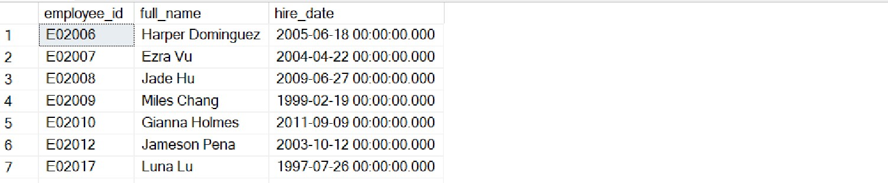

_This query retrieves the employee_id, full_name, and hire_date from the employees table. DATEDIFF function is then used to calculate the difference in days between the current date and the hire_date for each employee and compare this difference to 3650 (which is approximately 10 years' worth of days) to identify employees who have been with the company for more than 10 years._

--14. Calculate the average bonus percentage for employees under the age of 30.

`SELECT ROUND(AVG(bonus_percentage), 2) AS avg_bonus_percentage
FROM employees
WHERE age < 30;`

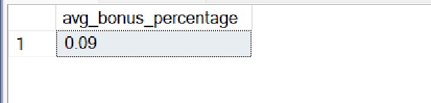

_This query filters the employees with an age less than 30 and calculates the average of their bonus percentages._

--15. Compare the distribution of bonus percentages across different ethnicities.

`SELECT ethnicity,
ROUND(AVG(bonus_percentage), 2) AS avg_bonus_percentage,
ROUND(MIN(bonus_percentage), 2) AS min_bonus_percentage,
ROUND(MAX(bonus_percentage), 2) AS max_bonus_percentage,
COUNT(*) AS total_count
FROM employees
GROUP BY ethnicity
ORDER BY total_count;`

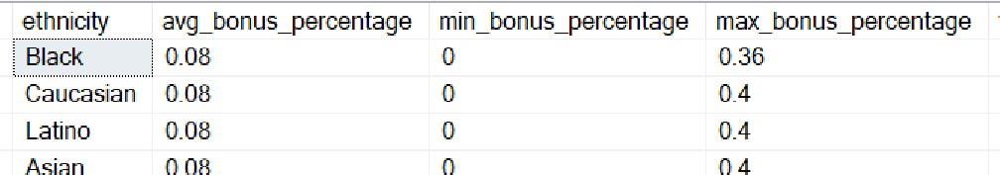

_This query calculates the average, minimum, and maximum bonus percentages for each ethnicity group, as well as the total count of employees in each group. This will give insights into how bonus percentages are distributed across different ethnicities in your dataset._

## Insights

1. The Vice President had the highest average salary. Across all 5 Job Titles, the Average Salary ranged from $106,536.2 to $220,125.787. However, Engineering is the top-paid department, with an average salary spanning $155,911.9483 to $171,666 across 7 departments.

2. The histogram displays bonus percentages, annual salaries, and business units. It illustrates the distribution of bonuses and salaries within different business units. The average salary exhibited an overall upward trend, rising by 17.32% from 1993 to 2022. However, there was a decline starting in 2006, with a decrease of 1.49% ($1,678.18) over 16 years. The most significant drop occurred between 2006 and 2022, going from $112,721.18 to $111,043.

3. The female employee count (515) exceeded that of males (485). Females constituted 51.50%, while males were 48.50% of the total employee count. Among ethnicities, Asian had the highest employee count at 432, followed by Latino, Caucasian, and Black. Asians represented 43.20% of the total employee count.

4. At 45.63, IT had the highest Average Age and was 10.34% higher than Marketing, which had the lowest Average Age at 41.35. Across all 7 departments, the Average Age ranged from 41.35 to 45.63. The table displays job titles, annual salaries, average bonus percentages, and average ages. It provides insights into the compensation, bonus distribution, and age demographics across different job roles.

## Recommendations

1. Focus on strategies to retain top talent in Engineering and continue to provide competitive compensation packages.
2. Implement initiatives to sustain the overall positive salary trend observed between 1993 and 2022.
3. Implement strategies to foster an inclusive workplace environment for all genders and ethnicities.
4. Leverage the insights from the provided table to fine-tune compensation and age-related strategies for different job titles and departments.

## Conclusion

The Employee Data Analysis Report provides valuable insights into the organization's workforce dynamics, highlighting areas of strength and opportunities for improvement. By implementing the recommended strategies, the organization can optimize its human resource management practices, leading to increased employee satisfaction, better retention rates, and enhanced overall performance.

`

